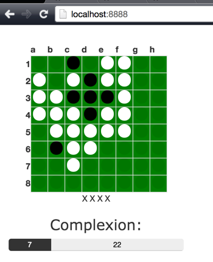

othello_ruby
============

Made as an example of Artificial Intelligence



Features
------------

+ Free-size board (default is 8 x 8)
+ Minimax AI Player
+ Watch the game from the Web (the above picture)


How to Use
------------

```sh
ruby webserver.rb
```
then
```sh
ruby othello_game.rb
open index.html
cat kifu.txt
```
